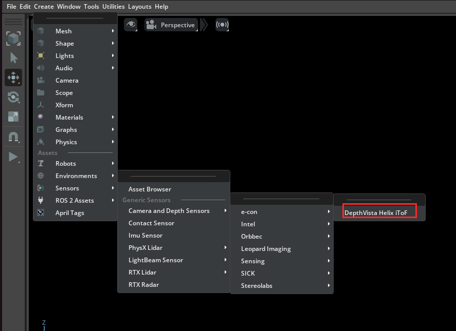
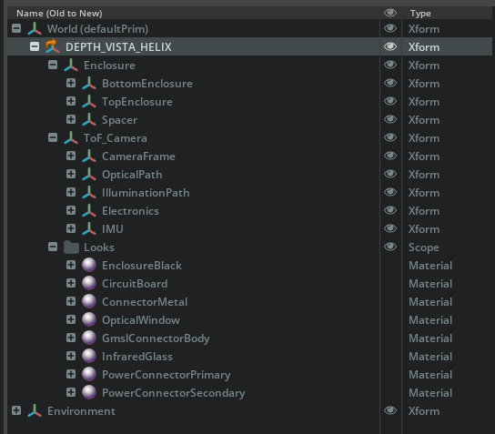
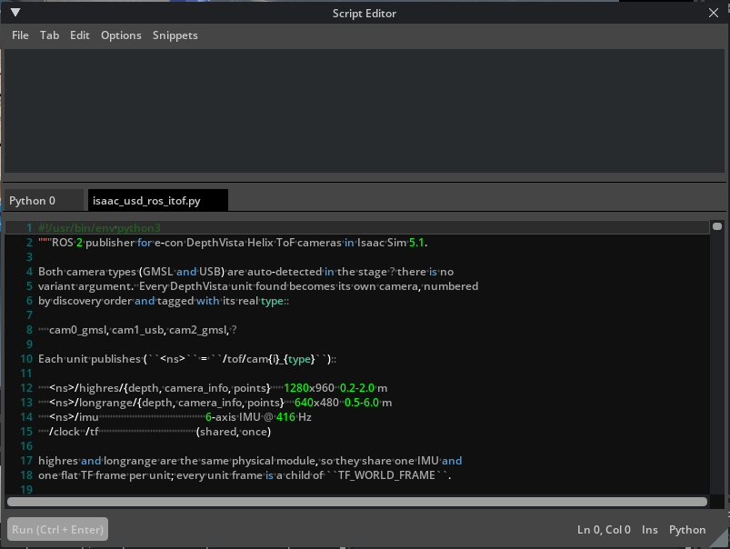
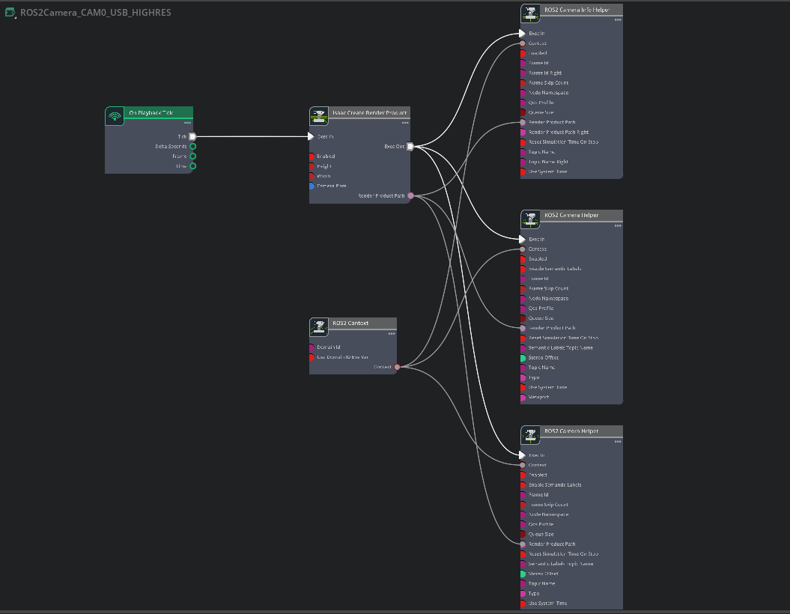
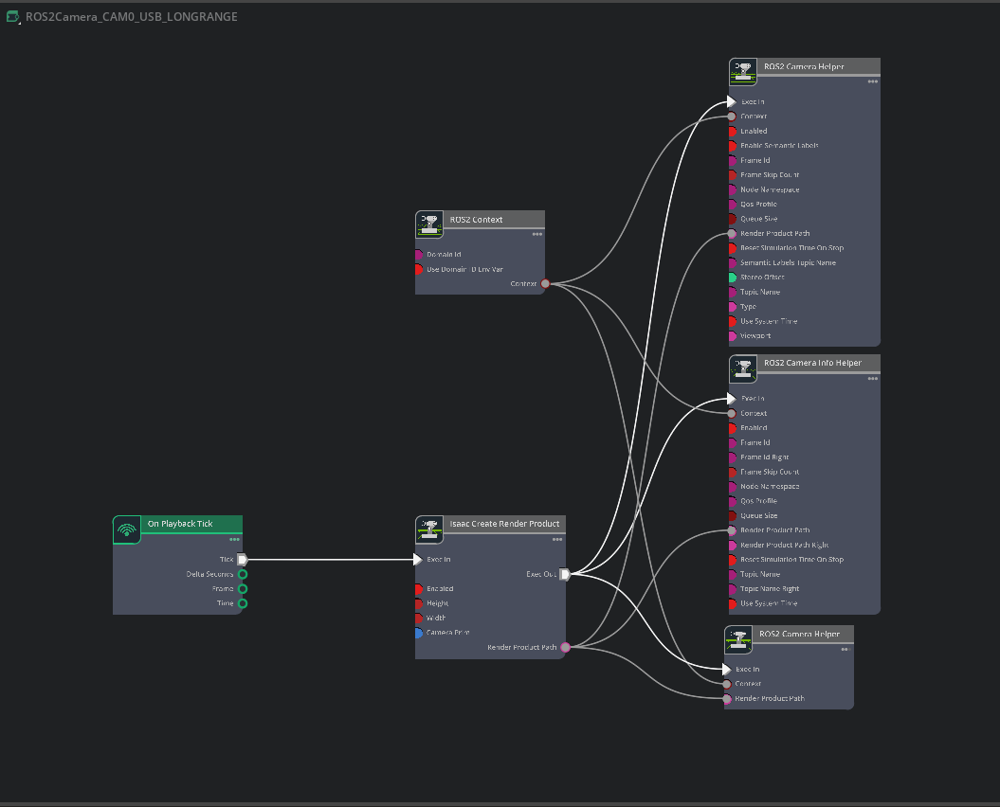
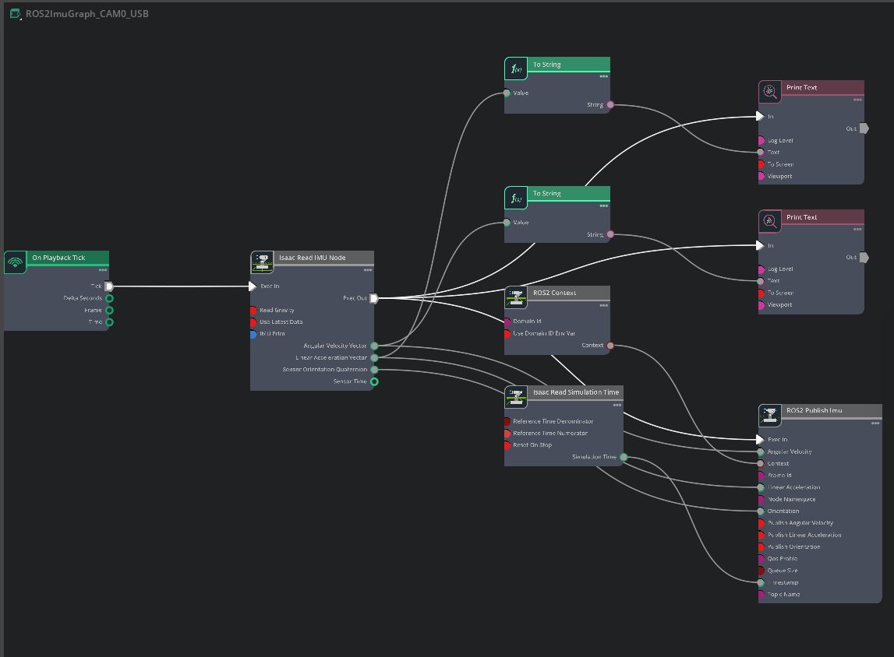
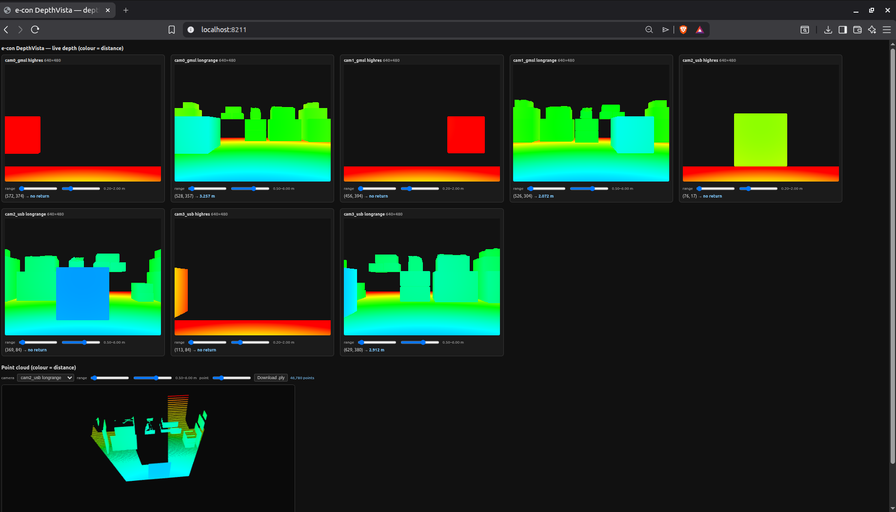

# e-con DepthVista Helix iToF — Isaac Sim

Adds the **e-con DepthVista Helix iToF** camera to Isaac Sim's supported camera and depth sensors,
with the digital-twin assets available in the Content Browser, plus an optional ROS 2 publisher
and a browser depth viewer.

## Requirements

- **NVIDIA Isaac Sim ≥ 5.1.0** — refer to the
  [installation guide](https://docs.isaacsim.omniverse.nvidia.com/latest/installation/install_workstation.html).
  Tested on 5.1.0 and 6.0.0, on both Windows and Linux.

## Installation

**Linux**
```bash
git clone https://github.com/Thagasheriff64/econ-isaac-sim.git
cd econ-isaac-sim
./build.sh
```

**Windows**
```bat
git clone https://github.com/Thagasheriff64/econ-isaac-sim.git
cd econ-isaac-sim
build.bat
```

- Auto-detects Isaac Sim (prompts for the folder if not found).
- Copies the extension into `extsUser` inside the Isaac Sim folder — it is self-contained, so the
  cloned repository can be deleted afterwards — and auto-loads on every launch.
- Remove it with the [uninstaller](#uninstallation), not by deleting files.

## Usage

1. Relaunch Isaac Sim if it is already running.
2. Open **Create → Sensors → Camera and Depth Sensors → e-con**.
3. Select **DepthVista Helix iToF** — added under `/World`.



## Camera variants

| File | Connector |
|------|-----------|
| `DEPTHVISTA_HELIX_GMSL.usd` | GMSL |
| `DEPTHVISTA_HELIX_USB.usd`  | USB |

- The menu exposes a single entry — **DepthVista Helix iToF** (the GMSL variant).
- For the USB variant, reference
  [`DEPTHVISTA_HELIX_USB.usd`](exts/econ.itof.menu/assets/DEPTHVISTA_HELIX_USB.usd) into your stage
  directly.



## ROS 2 streaming (optional)

[`ros2/isaac_usd_ros_itof.py`](ros2/isaac_usd_ros_itof.py) publishes every DepthVista camera in
the stage.

- **Detection** — all cameras found automatically; no arguments.
- **Naming** — `cam`; `cam0`, `cam1`, … when more than one; `_gmsl` / `_usb` suffix for explicit
  variants.
- **Scales** — generates the topics and OmniGraph sets for each camera automatically.

> Uses the **ROS 2 Humble** libraries bundled with Isaac Sim (`isaacsim.ros2.bridge`) — no system
> ROS 2 is needed to publish. ROS 2 Humble is required only on the consumer side (RViz,
> `ros2 topic echo`).

Namespace `<ns> = /tof/cam` (a `{i}` index is added only when more than one camera is present,
plus a `_{type}` suffix for the GMSL/USB variants):

| Topic | Stream | Resolution | Range |
|-------|--------|-----------|-------|
| `<ns>/highres/{depth, camera_info, points}`   | High-resolution depth and point cloud | 1280×960 | 0.2–2.0 m |
| `<ns>/longrange/{depth, camera_info, points}` | Long-range depth and point cloud | 640×480 | 0.5–6.0 m |
| `<ns>/imu` | 6-axis IMU | — | 416 Hz |
| `/clock`, `/tf` | Shared clock and transform tree | — | Published once |

`highres` and `longrange` are two configurations of the same module, so they share one IMU and one
TF frame per camera (a child of `world`).

### Running from the Script Editor

1. Add a camera (see [Usage](#usage)) and press **Play**.
2. Open **Window → Script Editor**.

   

3. Choose **File → Open**.

   

4. Select `econ-isaac-sim/ros2/isaac_usd_ros_itof.py`.

   

5. **Run** (or press **Ctrl+Enter**).

Graphs are created under a single `Graphs` scope (`<UNIT>` = upper-cased camera name, e.g. `CAM`,
`CAM0_GMSL`):

- **`ROS2SharedGraph`** — shared `/clock` and `/tf`.

  

- **`ROS2Camera_<UNIT>_HIGHRES`** — 1280×960 depth, camera_info, points.

  

- **`ROS2Camera_<UNIT>_LONGRANGE`** — 640×480, same publishers.

  

- **`ROS2ImuGraph_<UNIT>`** — IMU publish, with an optional on-screen readout.

  

Set `ROS2_DOMAIN_ID` (top of the script) to match your shell's `ROS_DOMAIN_ID`.

### Viewing in RViz

- Set the **Fixed Frame** to **`world`** (all camera frames are children of it).
- Rename it via `TF_WORLD_FRAME`; parent all frames under a prim via `TF_PARENT_PRIM`.

### Browser depth viewer (optional, no RViz)

Set `WEB_VIEWER = True` in [`ros2/isaac_usd_ros_itof.py`](ros2/isaac_usd_ros_itof.py) — the viewer
is served at `http://localhost:8211/`, alongside ROS 2.

> Refer to the script to set the other options as well.

- **Depth tiles** — live depth, colour-mapped by distance; a probe (cursor → last click → centre)
  reads the metric distance.
- **Point clouds** — per-camera checkboxes; interactive 3D (rotate / zoom / pan) with
  **Download .ply**.
- **Settings** — `WEB_VIEWER`, `WEB_VIEWER_PORT`, `WEB_VIEWER_HZ`, `WEB_VIEWER_MAX_W`.

The 3D view loads three.js from a CDN (needs internet); the 2D tiles work offline.



- **Stop** — `Ctrl+Alt+R` (viewport focused) or `teardown()`.
- **Restart** — run the file again; graphs, hotkey, and viewer reset automatically.

## Uninstallation

```bash
./uninstall.sh          # Linux
uninstall.bat           # Windows
```

Restores the `.kit` files and removes the extension.

## Notes

- Re-run the installer after reinstalling or updating Isaac Sim.
