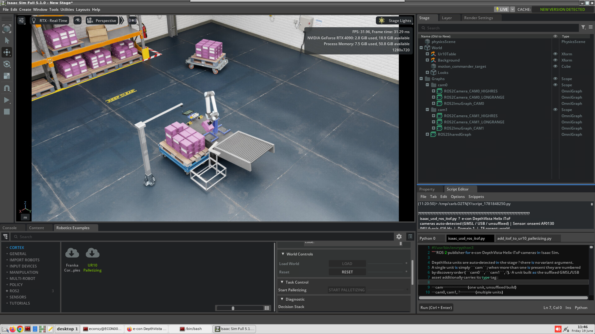
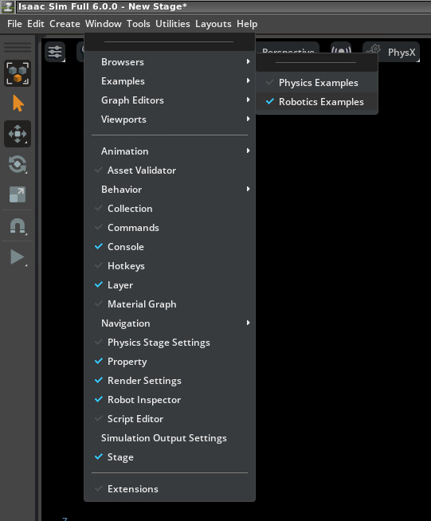
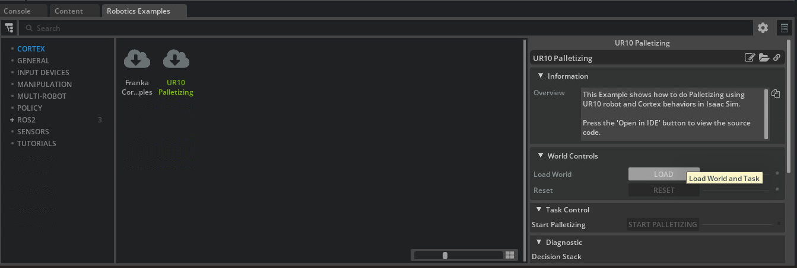
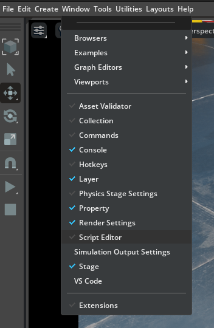
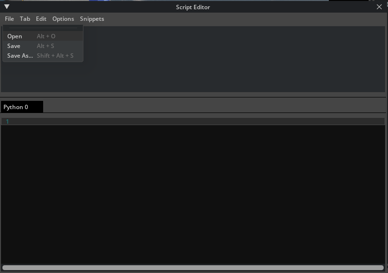
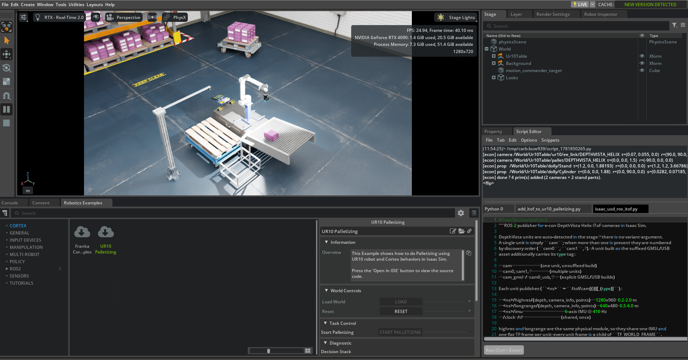

# Examples

Ready-to-run scripts that drop the e-con DepthVista Helix iToF camera into a
stock Isaac Sim scene. Run them from the **Script Editor** after installing the
extension (see the [main README](../README.md)).

---

## Example 1 — DepthVista cameras + floating-camera stand on UR10 Palletizing

[`add_itof_to_ur10_palletizing.py`](add_itof_to_ur10_palletizing.py) adds two
DepthVista Helix iToF cameras and a floating-camera stand to Isaac Sim's
**UR10 Palletizing** example — an eye-in-hand camera on the wrist and an
eye-to-hand camera over the pallet, plus a stand-mounted overhead camera.



### What it adds

| Prim | Role | Translate | Rotate XYZ | Scale |
|------|------|-----------|------------|-------|
| `…/ur10/ee_link/DEPTHVISTA_HELIX` | wrist camera (eye-in-hand) | (0.07, 0.055, 0) | (90, 90, 0) | mm→m |
| `…/pallet/DEPTHVISTA_HELIX` | over the pallet (eye-to-hand) | (0, 0, 1.5) | (-90, 0, 0) | mm→m |
| `…/dolly/Stand` | referenced Isaac Stand prop | (1.2, 0, 1.88193) | (0, 0, 0) | (1.2, 1.2, 3.66786) |
| `…/dolly/Cylinder` | stand arm (Create → Mesh → Cylinder) | (0.6, 0, 1.88) | (0, 90, 0) | (0.0282, 0.07185, 1.3) |

All paths are under `/World/Ur10Table`. The cameras reference the same USD the
Create menu uses and are placed at true scale. Re-running the script replaces
what it created, so it is idempotent.

### Requirements

- The extension installed (so the DepthVista USD is available) — see the
  [main README](../README.md#installation).
- The **UR10 Palletizing** example loaded (steps below).

### Step 1 — Load the UR10 Palletizing example

Open the Robotics Examples browser:

**Window → Robotics Examples**



Select **CORTEX → UR10 Palletizing**, then click **LOAD** (Load World and Task):



### Step 2 — Run the script

Open the Script Editor:

**Window → Script Editor**



In the Script Editor choose **File → Open**:



Select `econ-isaac-sim/examples/add_itof_to_ur10_palletizing.py`, then **Run**
(or **Ctrl+Enter**):


The console reports each prim it adds:

```
[econ] camera /World/Ur10Table/ur10/ee_link/DEPTHVISTA_HELIX …
[econ] camera /World/Ur10Table/pallet/DEPTHVISTA_HELIX …
[econ] prop   /World/Ur10Table/dolly/Stand …
[econ] prop   /World/Ur10Table/dolly/Cylinder …
[econ] done — 4 prim(s) added (2 cameras + 2 stand parts).
```

### Result

The two cameras and the floating-camera stand now sit in the palletizing scene:



### Stream / inspect the cameras (optional)

With the cameras in the scene, press **Play** and run
[`../ros2/isaac_usd_ros_itof.py`](../ros2/isaac_usd_ros_itof.py) to publish ROS 2
depth / point cloud / camera_info / IMU and open the browser depth viewer. See
[ROS 2 streaming](../README.md#ros-2-streaming-optional) in the main README.

### Notes

- If the script prints `… missing — load 'UR10 Palletizing' first`, the example
  scene isn't loaded yet; do Step 1 and re-run.
- Edit the `CAMERAS` / `PROPS` tables at the top of the script to change the
  mounting transforms.
