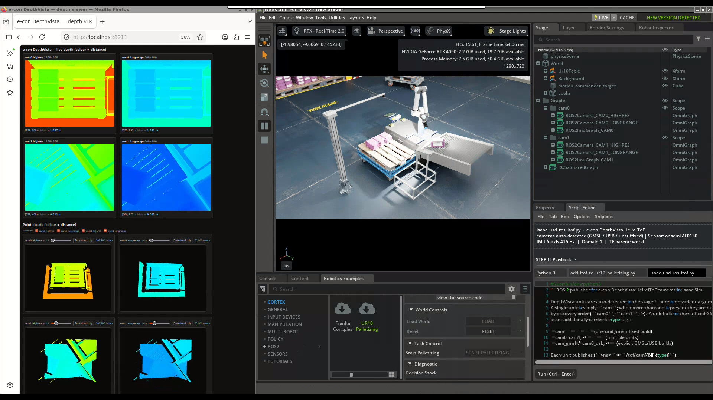
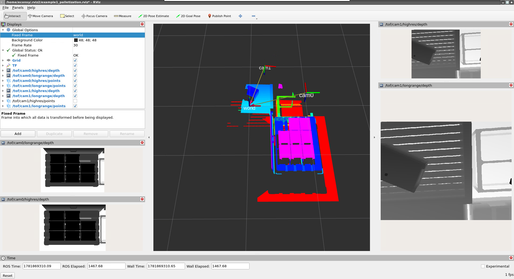
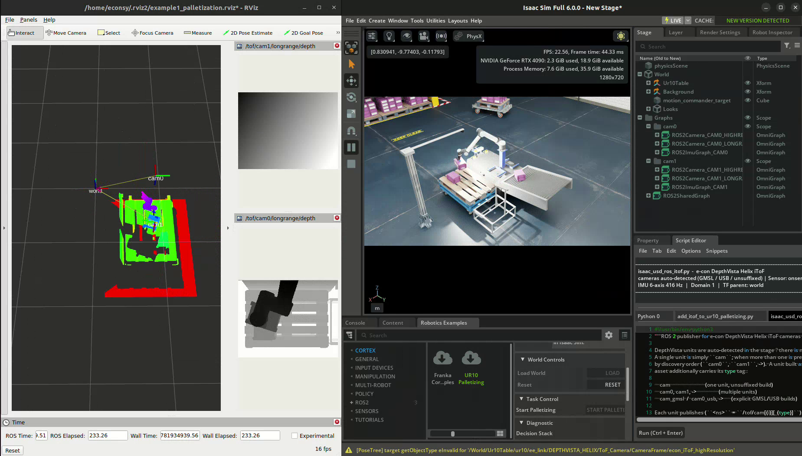

# Examples

Ready-to-run scripts that drop the e-con DepthVista Helix iToF camera into a
stock Isaac Sim scene. Run them from the **Script Editor** after installing the
extension (see the [main README](../README.md)).

---

## Example 1 — DepthVista cameras + over-pallet camera stand on UR10 Palletizing

[`add_itof_to_ur10_palletizing.py`](add_itof_to_ur10_palletizing.py) adds two
DepthVista Helix iToF cameras to Isaac Sim's **UR10 Palletizing** example — an
eye-in-hand camera on the wrist and an eye-to-hand camera over the pallet — plus
a camera stand for the over-pallet view.


### What it adds

| Prim | Role | Translate | Rotate XYZ | Scale |
|------|------|-----------|------------|-------|
| `…/ur10/ee_link/DEPTHVISTA_HELIX` | wrist camera (eye-in-hand) | (0.07, 0.055, 0) | (180, -90, 90) | mm→m |
| `…/pallet/DEPTHVISTA_HELIX` | over the pallet (eye-to-hand) | (0, 0, 1.5) | (-90, 0, 0) | mm→m |
| `…/dolly/CameraStand/Stand` | referenced Isaac Stand prop | (1.2, 0, 1.88193) | (0, 0, 0) | (1.2, 1.2, 3.66786) |
| `…/dolly/CameraStand/Cylinder` | stand arm (Create → Mesh → Cylinder) | (0.6, 0, 1.88) | (0, 90, 0) | (0.0282, 0.07185, 1.3) |

All paths are under `/World/Ur10Table`. The cameras reference the same USD the
Create menu uses and are placed at true scale. The stand and its arm are grouped
under one `CameraStand` node, so they behave as a single part. Re-running the
script replaces what it created, so it is idempotent.

### Requirements

- The extension installed (so the DepthVista USD is available) — see the
  [main README](../README.md#installation).
- The **UR10 Palletizing** example loaded (steps below).

### Step 1 — Load the UR10 Palletizing example

Open the Robotics Examples browser via **Window → Robotics Examples**:


Select **CORTEX → UR10 Palletizing**, then click **LOAD** (Load World and Task):


### Step 2 — Run the script

Open the Script Editor (**Window → Script Editor**):


Choose **File → Open**:


Select `econ-isaac-sim/examples/add_itof_to_ur10_palletizing.py`, then **Run**
(or **Ctrl+Enter**):


The console reports each prim it adds:

```
[econ] camera /World/Ur10Table/ur10/ee_link/DEPTHVISTA_HELIX …
[econ] camera /World/Ur10Table/pallet/DEPTHVISTA_HELIX …
[econ] prop   /World/Ur10Table/dolly/CameraStand/Stand …
[econ] prop   /World/Ur10Table/dolly/CameraStand/Cylinder …
[econ] done — 4 prim(s) added (2 cameras + 2 stand parts).
```

The two cameras and the camera stand now sit in the palletizing scene:


### Output — stream and visualise

With the cameras in the scene, press **Play** and run
[`../ros2/isaac_usd_ros_itof.py`](../ros2/isaac_usd_ros_itof.py) from the Script
Editor. It publishes ROS 2 depth / point cloud / camera_info / IMU for both
cameras and serves the browser depth viewer.

**Browser depth viewer** (`http://localhost:8211/`) — live colour-mapped depth
tiles and interactive point clouds, no RViz needed:



*Fast-forward preview — click to watch the full recording:*

[](../docs/Example1_Palletization/videos/web-viewer-demo.webm)

**RViz** — the per-camera point clouds fused in the `world` frame, with the
published topics in the Displays panel:





*Fast-forward preview — click to watch the full recording:*

[](../docs/Example1_Palletization/videos/rviz-demo.webm)

Topics (two cameras → `cam0` over the pallet, `cam1` on the wrist):

```
$ ros2 topic list
/clock
/tf
/tof/cam0/highres/camera_info
/tof/cam0/highres/depth
/tof/cam0/highres/points
/tof/cam0/longrange/camera_info
/tof/cam0/longrange/depth
/tof/cam0/longrange/points
/tof/cam0/imu
/tof/cam1/highres/camera_info
/tof/cam1/highres/depth
/tof/cam1/highres/points
/tof/cam1/longrange/camera_info
/tof/cam1/longrange/depth
/tof/cam1/longrange/points
/tof/cam1/imu
```

> The GIFs are short, sped-up previews. The full recordings live in
> [`../docs/Example1_Palletization/videos/`](../docs/Example1_Palletization/videos).

### Notes

- If the script prints `… missing — load 'UR10 Palletizing' first`, the example
  scene isn't loaded yet; do Step 1 and re-run.
- Edit the `CAMERAS` / `PROPS` tables at the top of the script to change the
  mounting transforms.

### Media layout

```
docs/Example1_Palletization/
├── images/   step + output screenshots (00–09)
├── gifs/     fast-forward (×4) previews of the first ~2.3 min
└── videos/   recordings, first ~2.3 min (web-viewer-demo.webm, rviz-demo.webm)
```
