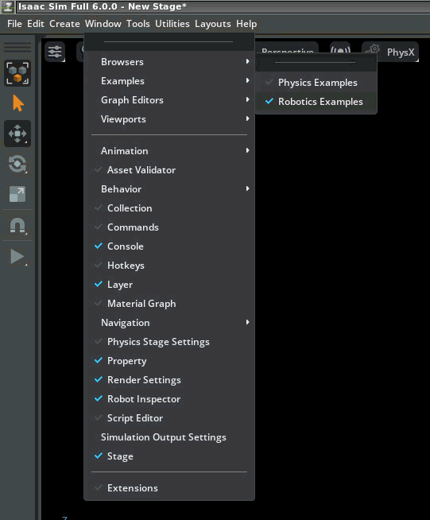
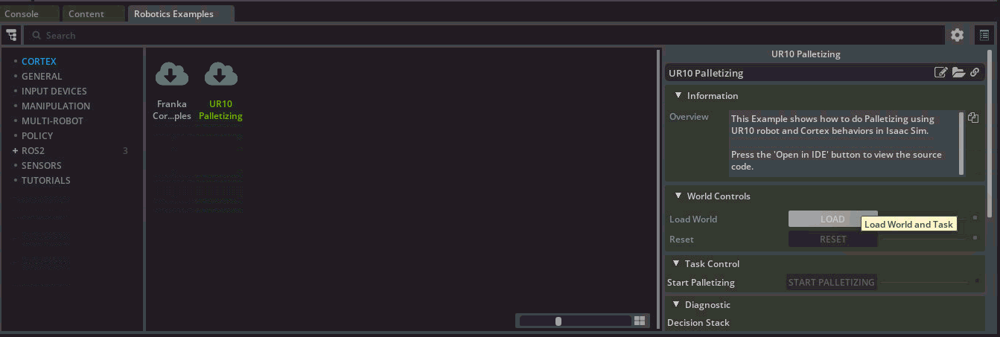
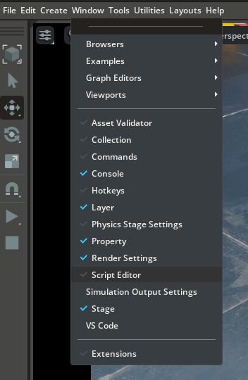
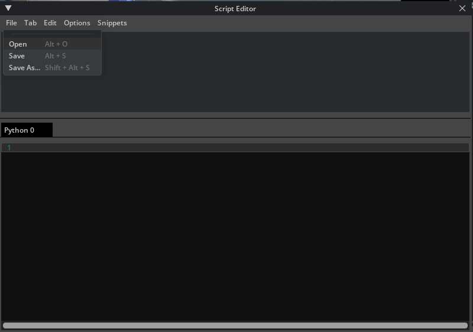
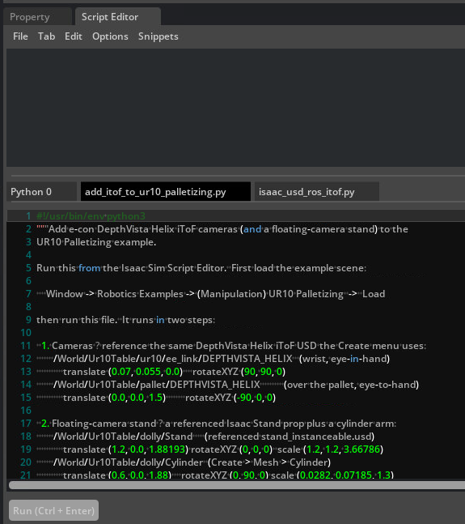
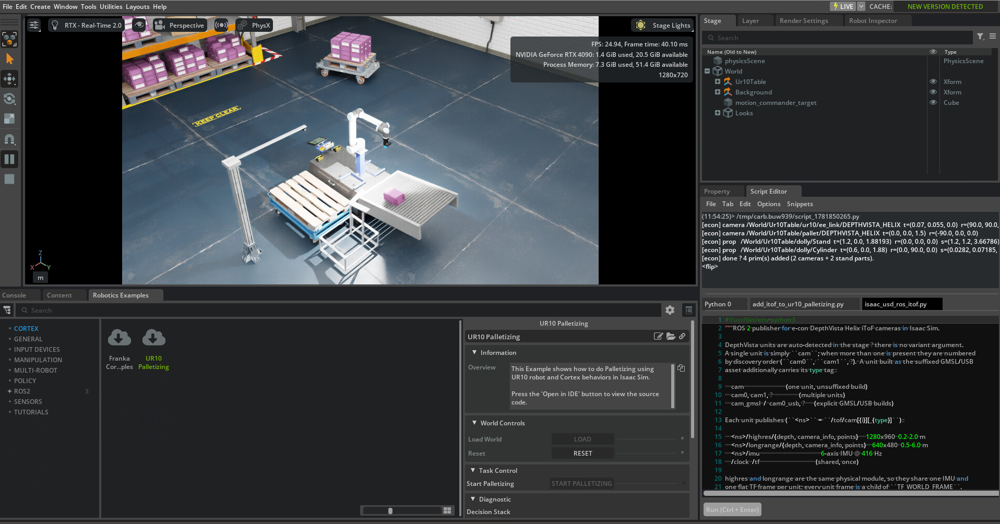
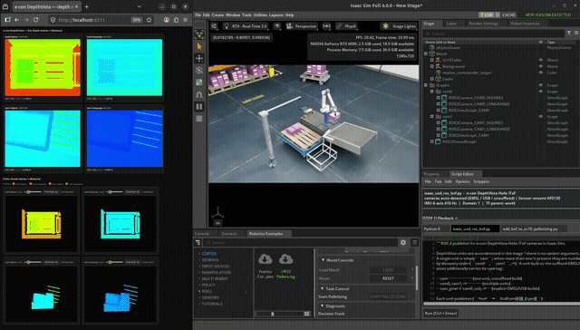
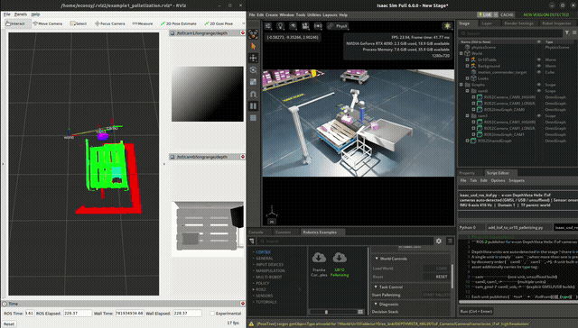

# Examples

Ready-to-run scripts that add the e-con DepthVista Helix iToF camera to a stock
Isaac Sim scene. Run them from the **Script Editor** after installing the
extension (see the [main README](../README.md)).

---

## Example 1 — DepthVista cameras and an over-pallet camera stand on UR10 Palletizing

Isaac Sim's **UR10 Palletizing** example (Robotics Examples → CORTEX) runs a UR10
arm that picks boxes and stacks them onto a pallet using Cortex behaviours.
[`add_itof_to_ur10_palletizing.py`](add_itof_to_ur10_palletizing.py) augments
that scene with two DepthVista Helix iToF cameras — an eye-in-hand camera on the
wrist and an eye-to-hand camera over the pallet — together with a stand that
carries the over-pallet camera.


### What it adds

| Prim | Role | Translate | Rotate XYZ | Scale |
|------|------|-----------|------------|-------|
| `…/ur10/ee_link/DEPTHVISTA_HELIX` | Wrist camera (eye-in-hand) | (0.07, 0.055, 0) | (180, -90, 90) | mm → m |
| `…/pallet/DEPTHVISTA_HELIX` | Over the pallet (eye-to-hand) | (0, 0, 1.5) | (-90, 0, 0) | mm → m |
| `…/dolly/CameraStand/Stand` | Referenced Isaac Stand prop | (1.2, 0, 1.88193) | (0, 0, 0) | (1.2, 1.2, 3.66786) |
| `…/dolly/CameraStand/Cylinder` | Stand arm (Create → Mesh → Cylinder) | (0.6, 0, 1.88) | (0, 90, 0) | (0.0282, 0.07185, 1.3) |

All prims are created under `/World/Ur10Table`. The cameras reference the same
USD as the Create menu and are placed at true scale. The stand and its arm are
grouped under a single `CameraStand` node, so they behave as one part. The
script is idempotent — re-running it replaces what it created.

### Requirements

- The extension installed, so the DepthVista USD is available — see the
  [main README](../README.md#installation).
- The **UR10 Palletizing** example loaded (Step 1 below).

### Step 1 — Load the UR10 Palletizing example

Open the Robotics Examples browser via **Window → Robotics Examples**:



Select **CORTEX → UR10 Palletizing**, then click **LOAD** (Load World and Task):



### Step 2 — Run the script

Open the Script Editor (**Window → Script Editor**):



Choose **File → Open**:



Select `econ-isaac-sim/examples/add_itof_to_ur10_palletizing.py`, then **Run**
(or press **Ctrl+Enter**):



The console reports each prim it adds:

```
[econ] camera /World/Ur10Table/ur10/ee_link/DEPTHVISTA_HELIX …
[econ] camera /World/Ur10Table/pallet/DEPTHVISTA_HELIX …
[econ] prop   /World/Ur10Table/dolly/CameraStand/Stand …
[econ] prop   /World/Ur10Table/dolly/CameraStand/Cylinder …
[econ] done — 4 prim(s) added (2 cameras + 2 stand parts).
```

The two cameras and the camera stand now appear in the palletizing scene:



### Output — stream and visualise

With the cameras in the scene, press **Play** and run
[`../ros2/isaac_usd_ros_itof.py`](../ros2/isaac_usd_ros_itof.py) from the Script
Editor. It publishes ROS 2 depth, point cloud, camera_info, and IMU topics for
both cameras, and serves the browser depth viewer.

**Browser depth viewer** (`http://localhost:8211/`) — live, colour-mapped depth
tiles and interactive point clouds, with no RViz required:



**RViz** — the per-camera point clouds fused in the `world` frame:



Published topics (two cameras → `cam0` over the pallet, `cam1` on the wrist):

```
$ ros2 topic list
/clock
/tf
/tof/cam0/highres/camera_info
/tof/cam0/highres/depth
/tof/cam0/highres/points
/tof/cam0/longrange/camera_info
/tof/cam0/longrange/depth
/tof/cam0/longrange/points
/tof/cam0/imu
/tof/cam1/highres/camera_info
/tof/cam1/highres/depth
/tof/cam1/highres/points
/tof/cam1/longrange/camera_info
/tof/cam1/longrange/depth
/tof/cam1/longrange/points
/tof/cam1/imu
```

### Demo videos

- ▶ [**Browser depth viewer**](../docs/Example1_Palletization/videos/web-viewer-demo.webm) — live depth tiles and interactive point clouds.
- ▶ [**RViz point clouds**](../docs/Example1_Palletization/videos/rviz-demo.webm) — the fused point clouds and the published topics.
